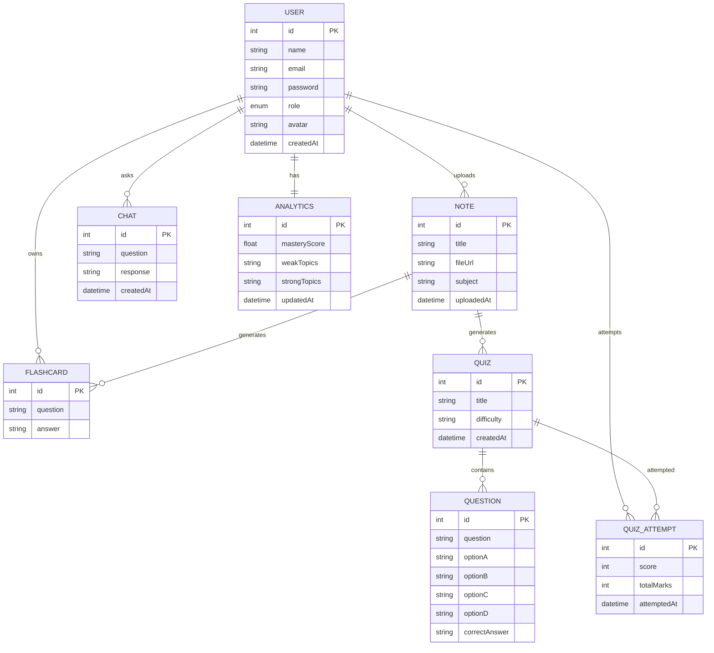

# 🗄️ EduBridge ER Diagram

This Entity Relationship Diagram (ERD) represents the database schema for EduBridge.

```mermaid
erDiagram

    USER {
        int id PK
        string name
        string email
        string password
        enum role
        string avatar
        datetime createdAt
    }

    NOTE {
        int id PK
        string title
        string fileUrl
        string subject
        datetime uploadedAt
    }

    CHAT {
        int id PK
        string question
        string response
        datetime createdAt
    }

    FLASHCARD {
        int id PK
        string question
        string answer
    }

    QUIZ {
        int id PK
        string title
        string difficulty
        datetime createdAt
    }

    QUESTION {
        int id PK
        string question
        string optionA
        string optionB
        string optionC
        string optionD
        string correctAnswer
    }

    QUIZ_ATTEMPT {
        int id PK
        int score
        int totalMarks
        datetime attemptedAt
    }

    ANALYTICS {
        int id PK
        float masteryScore
        string weakTopics
        string strongTopics
        datetime updatedAt
    }

    USER ||--o{ NOTE : uploads
    USER ||--o{ CHAT : asks
    USER ||--o{ FLASHCARD : owns
    USER ||--o{ QUIZ_ATTEMPT : attempts
    USER ||--|| ANALYTICS : has

    NOTE ||--o{ FLASHCARD : generates
    NOTE ||--o{ QUIZ : generates

    QUIZ ||--o{ QUESTION : contains
    QUIZ ||--o{ QUIZ_ATTEMPT : attempted
```