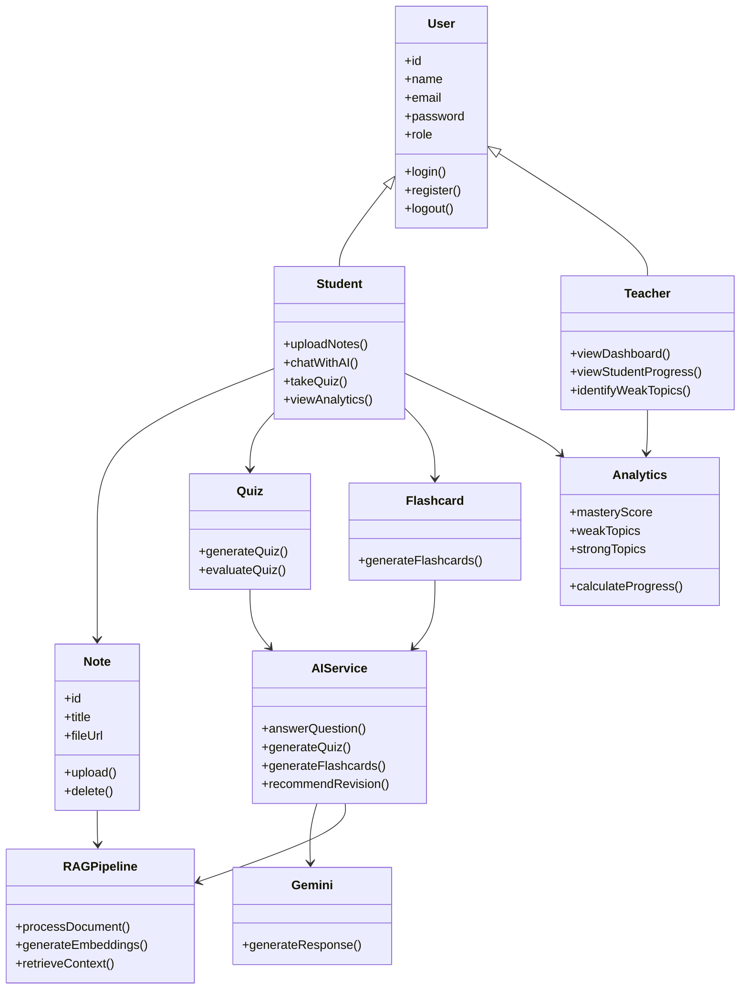

# 📘 EduBridge UML Class Diagram

```mermaid
classDiagram

class User{
+id
+name
+email
+password
+role
+login()
+register()
+logout()
}

class Student{
+uploadNotes()
+chatWithAI()
+takeQuiz()
+viewAnalytics()
}

class Teacher{
+viewDashboard()
+viewStudentProgress()
+identifyWeakTopics()
}

class Note{
+id
+title
+fileUrl
+upload()
+delete()
}

class Quiz{
+generateQuiz()
+evaluateQuiz()
}

class Flashcard{
+generateFlashcards()
}

class Analytics{
+masteryScore
+weakTopics
+strongTopics
+calculateProgress()
}

class AIService{
+answerQuestion()
+generateQuiz()
+generateFlashcards()
+recommendRevision()
}

class RAGPipeline{
+processDocument()
+generateEmbeddings()
+retrieveContext()
}

class Gemini{
+generateResponse()
}

User <|-- Student
User <|-- Teacher

Student --> Note
Student --> Quiz
Student --> Flashcard
Student --> Analytics

Teacher --> Analytics

AIService --> Gemini
AIService --> RAGPipeline

Quiz --> AIService
Flashcard --> AIService
Note --> RAGPipeline
```