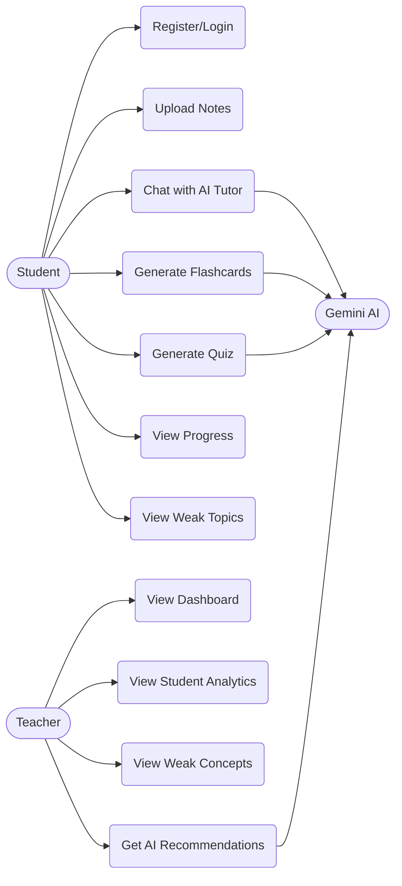

# 🎯 EduBridge Use Case Diagram

```mermaid
flowchart LR

Student([Student])
Teacher([Teacher])
Gemini([Gemini AI])

Student --> UC1(Register/Login)
Student --> UC2(Upload Notes)
Student --> UC3(Chat with AI Tutor)
Student --> UC4(Generate Flashcards)
Student --> UC5(Generate Quiz)
Student --> UC6(View Progress)
Student --> UC7(View Weak Topics)

Teacher --> UC8(View Dashboard)
Teacher --> UC9(View Student Analytics)
Teacher --> UC10(View Weak Concepts)
Teacher --> UC11(Get AI Recommendations)

UC3 --> Gemini
UC4 --> Gemini
UC5 --> Gemini
UC11 --> Gemini
```